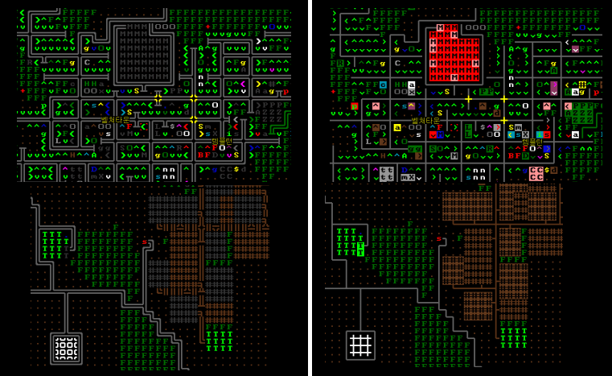

# CDDA-ASCIITileset-fix
A fixed ASCIITileset version for overmap use.

A fix that covers all overmap tiles in vanila cdda and the default mods in 'data/mods' folder.

Fixes:
All buildings that have its background color.
The direction of the buildings.
Rotated roads.
Weathers now shown.

